Metro technical
====================
# Transaction Processing System

This project is designed to receive and process user transactions through a REST API. The system stores transactions in MongoDB, registers each transaction in a messaging broker, and generates a daily summary of the total transaction value. 

This application is built on top of [Quarkus 3.0.0](https://quarkus.io/) and uses built-in functionality in Quarkus to implement REST services, repositories, and services.


Prerequisites
-----------------

There are a few things you'll need to have installed to get this up and running.

**Java**

- [Java 21](https://aws.amazon.com/corretto/)
- [Quarkus](https://quarkus.io//)
- [MongoDB](https://quarkus.io/guides/mongodb-panache)
- [Docker](https://www.docker.com/)
- [RabbitMQ (as the messaging broker)](https://www.rabbitmq.com/)
- [MapStruct (for DTO mapping)](https://mapstruct.org/)
- [Resilience4j (for fault tolerance)](https://resilience4j.readme.io/docs/getting-started)
- [Swagger (Documentation)](https://swagger.io/)


**Maven**

- [version 3.9.2](https://maven.apache.org/download.cgi)

### Clone the Repository
```sh
git clone https://github.com/canmios/system_transaction.git
cd transaction-processing-system
```

### Build the Project
```sh
mvn clean install
```

### Start the services:

```sh
docker-compose up -d
```

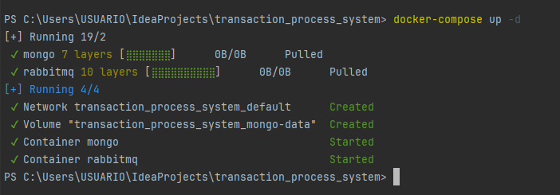
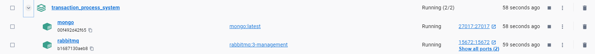

### Run the Application 
#### After starting the Docker services, you can run the Quarkus application.

```sh
.\mvnw.cmd quarkus:dev
```
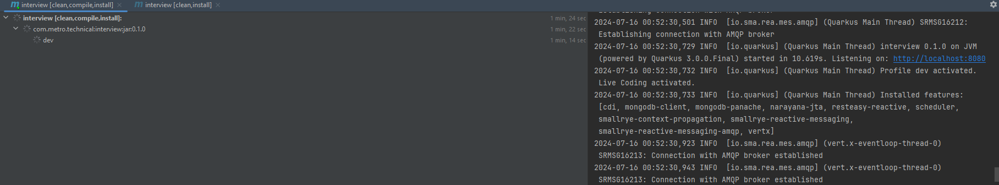

### Running this application ###

To run this application from the command line with Maven:

Or in an IDE, just run the `Application` class

Verify that the application is functioning as expected by checking: http://localhost:8080/

Overview
-----------

We have provided a few basic services for use in our metro transaction application: 
- `TransactionResource`  - REST api - create the transaction
- `DailySummaryScheduler` - Scheduler for generating daily summary, running every 24 hrs.
   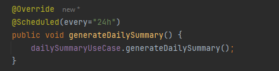
- `DailySummaryService` - Generate process transactions logic
- `DailySummaryService` - Generate daily summary logic 
- `TransactionRepository` `DailySummaryRepository` - MongoDB repository
- `TransactionProcessor` `TransactionPublisher` - Messaging components
- `DailySummarySchedulerDoc` `TransactionResourceDoc` - Swagger documentation

#### REST Services ####
```
curl -X POST http://localhost:8080/transactions \
    -H "Content-Type: application/json" \
    -d '{
        "transaction_id": "12345",
        "timestamp": "2024-07-15T12:00:00Z",
        "device_number": "device123",
        "user_id": "user123",
        "geo_position": "40.7128,-74.0060",
        "amount": 100.0
    }'
```

Hexagonal arquitecture.
-----------
Hexagonal Architecture fosters a modular, testable, and maintainable codebase by structuring the application around its core business logic while adapting to various external interfaces through well-defined ports and adapters. This architectural pattern aligns with the project's goals of scalability, maintainability, and flexibility in integrating with external services like MongoDB, RabbitMQ, and others.

Take advantage of built-in Quarkus functionality and have good design, code maintenance and including design patterns that are inherent to hexagonal architecture 

Testing
-----------
### Folder
```src/test/java/com/metro/technical'``` - Unit testing.

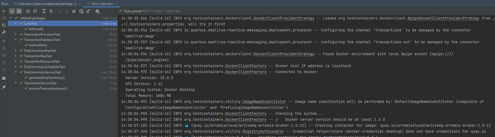

### Post transaction

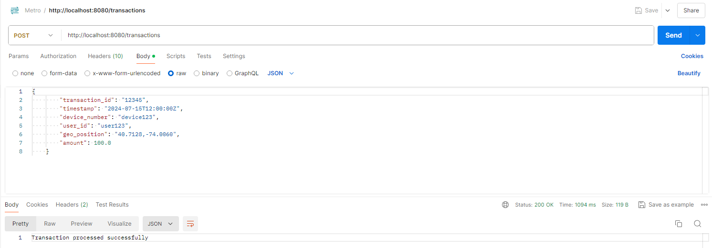

### Debugging scheduler every 60 seg for testing

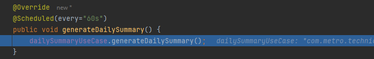

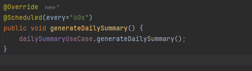

## Load testing 

Folder 
```src/test/java/com/metro/technical/domain/load/LoadTest.java'``` - Unit testing for validating the transactions.

A reactive programming has been implemented with Quarkus to improve the concurrency performance, the number of threads 
has been configured to guarantee the transaction load, also the implementation of java 21 that significantly improves 
its virtual machine with a thread management with an improvement in the performance and thread management in the JVM. In addition, a resilient Circuit breaker has been implemented that will allow to manage or stop the loads when the system cannot support it.

### MongoDB Index Creation 
Run this in the mongoDB client
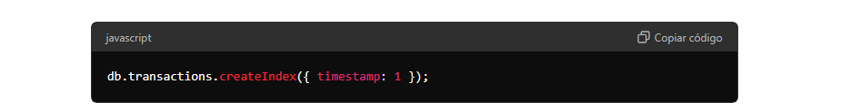

### Configuration Quarkus

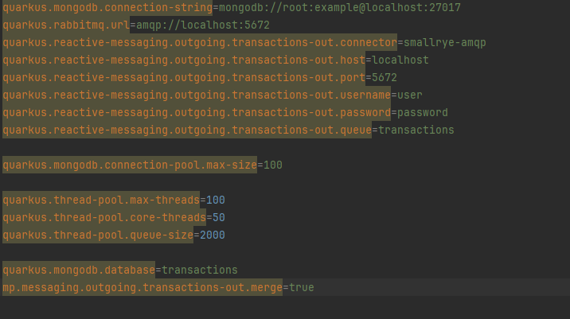

### SOAP UI - Load Testing 

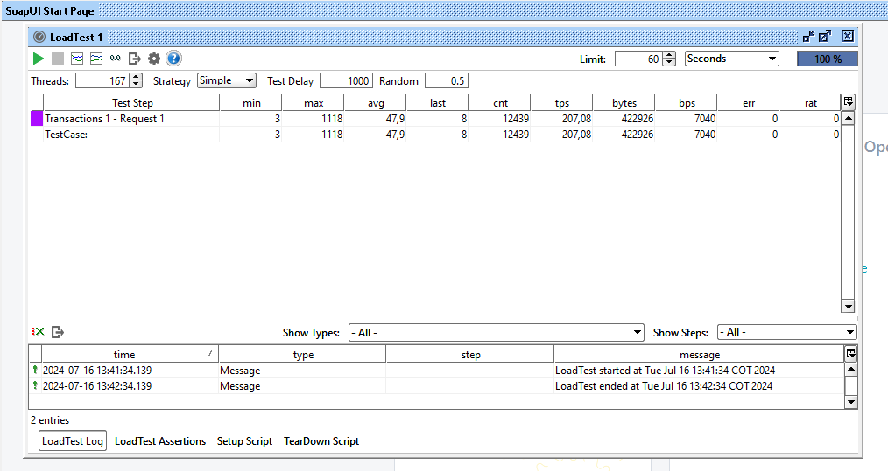

### Configuration MongoDB and RabbitMQ

MongoDB has been implemented for database management and persistence, RabbitMQ has also been implemented and will be used to manage transaction communication. 

## AWS and Kubernetes Performance Enhancement Alternative

Alternative of improvement with AWS, we can use the services provided with CLOUD and kubernetes to improve much more the performance, as now we have the dockerized image is simple for example deploy the application in EC2 instances, add a gateway and then balance the application with Elastic Load Balancing (ELB).

We can also use AWS EKS (Elastic Kubernetes Service): It simplifies Kubernetes deployment, scaling, and management by offloading the control plane to AWS while allowing you to focus on your applications.

Finally, we can also use Amazon S3 (Simple Storage Service): Utilize S3 for scalable object storage. Store static assets, backups, or other files that application needs.


